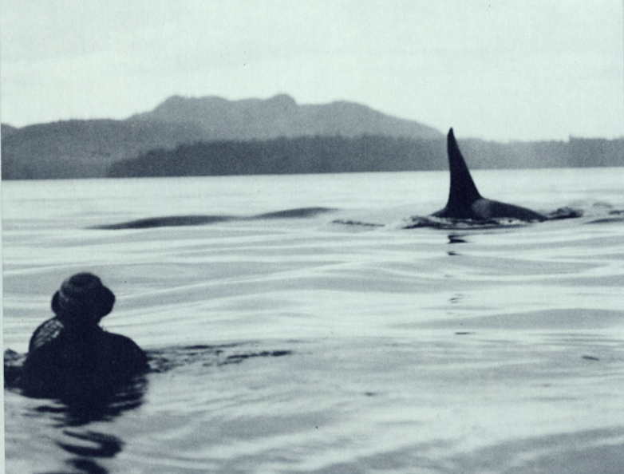

# 🌿🌿 care irl 🌿🌿
This 6 session course will explore the meaning of care offline in an increasingly online world. Students will be learn with and through each other with a focus on how their "in real life" actions affect one another. Each week, over a three hour session, students will be exposed to relevant reading material, community-oriented workshops, and open discussion. 

## 🌱 week 1 ~ bodies: offline & online
##### 🌕 lecture 
How does your mind affect your body and your body your mind? What does society tell us about what a body "should" or "shouldn't" be? 
##### 🌗 activity
Design a daily ritual that simultaneously involves your mind and body. Write down the things that might be hard to keep up on a daily basis. Write down the ways in which you think this ritual might be helpful (or not helpful) to your understanding of yourself.
##### 🌑 discussion 
Do you feel connected to your body? Do you feel connected to your mind? What does it mean to be comfortable in one's body? How does our mind affect our body and vice versa? How does your body feel offline? How does it feel online? What kinds of things can we do for ourselves to ensure that our minds and bodies are connected in a caring way?

## 🌱 week 2 ~ systems: offline & online
##### 🌕 lecture 
Building up a systems literacy. What is/isn't a system? 
##### 🌗 activity
Draw and label three separate systems that affect your daily life. Make connections between them. Are there systems within these systems? Which parts of the system can you control? Which parts are out of your control? How does these systems affect/not affect each other?
##### 🌑 discussion 
Design a system that you would want to live in and contribute to. 

## 🌱 week 3 ~ physicality of the internet
##### 🌕 lecture 
What does the internet look like? Where is it? How did it get built?
##### 🌗 activity
Draw a map of what you think the physical infrastructure of internet looks like in your town. 
##### 🌑 discussion 
How does the physicality of the Internet affect our physical environment? How does it affect our social environment? 

## 🌱 week 4 ~ what is a social network?
##### 🌕 lecture 
What does it mean to be social? What does it mean to be in a network? What can a social network be? What are the online effects of offline social networks? What are the offline effects of online social networks? Can a social network be offline and online at once? 
##### 🌗 activity
Design a social network online that takes cues from your real life social networks. Be mindful of who is in these social networks, what kind of "rules" are there, how do they expand? Draw or write about it.
##### 🌑 discussion  
Think about the social networks that you are a part of? What do they look like? Is there a kind of system in place? If not what kind of things are guiding this network to exist?

## 🌱 week 5 ~ practicing being, with each other 
##### 🌕 lecture 
How does the internet bring us together, and how does it separate us? What is community? How are communities different from systems and networks? 
##### 🌗 activity
Design a community garden. Share your design with a partner. Give each other feedback. What is the life of a plant in this garden? What is a life of a human in this garden? How do all them co-exist to make a community garden feel like a community garden?
##### 🌑 discussion 
How else can we come together outside of the systems that keep us together or apart? 

## 🌱 week 6 ~ teaching each other
##### 🌕 breathing practice 
The final class will start with a breathing meditation. We will do body scans and bring our breath to every possible part of our bodies in order to become aware of our bodies in space. 
##### 🌗 presentations
Students will present one of things made during the activities from the past 5 weeks. They are free to lecture, lead a discussion, make a visual artifact...it is completely up to them.
##### 🌑 discussion  
Each presentation will be followed by a short discussion. 

