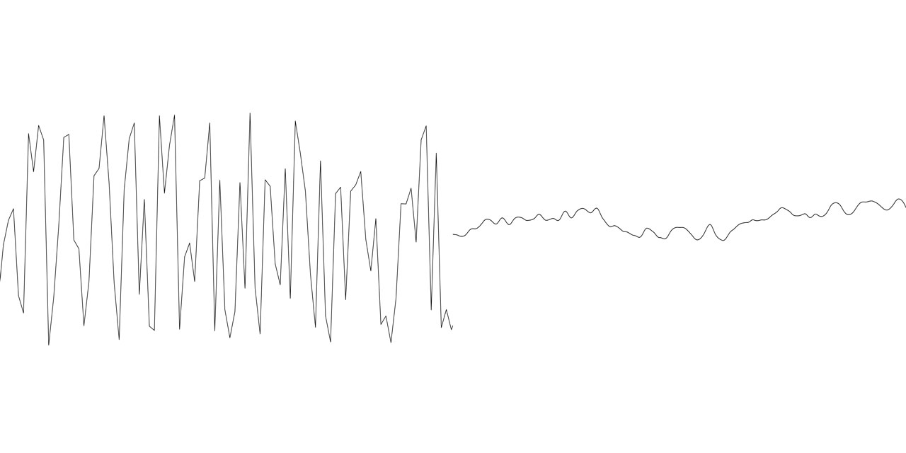

# Generative Random Art with p5.js

In this workshop, we ask the fundamental question of what randomness is and what it looks like. By asking students to express what they think random is, and by looking at what can constitute as randomness in nature, the workshop attempts at defining random. We ask the question of whether complete randomness is useful in creating visuals and explore ways to tame the randomness to create a desired controlled randomized visuals in p5.js, a javascript library for creating visuals.

Students will approach the concept of random first with pen and paper, to reflect on what their idea of random is. Then they will examine whether their idea of random is truly random and compare it with p5’s idea of randomness. We will also compare two functions that can be used to generate random values in p5.js: random() and noise(). We will attempt at gaining a deeper knowledge of these functions by applying different visuals using these functions and go further into controlling it with other functions such as modulus(%) and map().

Basic programming skills are recommended, but not necessary.

## Schedule
1. **Introductions**
2. **What is Random?**
Draw what you think random looks like on a piece of paper. Then discuss whether the drawing is
truly random or not random.
3. **What is Noise? What is Perlin Noise?**
 Draw what you think noise looks like. We will talk about how this drawing is different, or same, as the random drawings we did previously.
 
  
 
4. **Random vs Noise**
Where is random and noise found in nature? Have you seen or heard something random or noisy on your commute to here? We will look at graphs of random and noise drawn by p5.js and attempt at labelling the components that are being used to create the graphs. We will also look at p5 reference on the random() and noise() function to give us some hints. Are there similarities in the graphs? What are the differences? How would you define noise relative to random? How would you define random relative to noise?
5. **Quick introduction to p5.js** (depending on average skill level of students in p5, this section could be skipped.)

6. **Creating visuals with random() and noise() functions.**
We will think of ways of using the random() and noise() functions to create visuals. What do you FEEL when you see these random visuals? How can we enhance or counter the emotions you feel from these visuals? When would you want to use random(), and when would you want to use noise()?

## References:
* [Choreographic Interventions](https://github.com/mimiyin/choreographic-interventions-s19/), Mimi Yin
* Chapter 3: The Wrong Way to Draw A Line, [Generative Art](https://www.manning.com/books/generative-art), Matt Pearson.
* [Random Walks](https://natureofcode.com/book/introduction/), Nature Of Code, Daniel Shiffman
* [The random() Function](https://www.youtube.com/watch?v=nfmV2kuQKwA), Coding Train, Daniel Shiffman
* [Perlin Noise](https://www.youtube.com/watch?v=Qf4dIN99e2w), Coding Train, Daniel Shiffman

## Learning Objectives:
In this workshop, students will learn:
* to question the basics of a concept to be able to gain a deeper understanding and achieve higher level of control.
* to use random() and noise() functions in p5.js with greater degree of control and intention.
* to create visuals in p5.js using random() and noise() functions.
* to be able to distinguish when to use random() and when to use noise() function.

## Learning Outcome:
In this workshop, students will achieve:
* a deeper understanding of the concepts of random and noise.
* the ability to question whether something truly is "random" and "noisy".
* the ability to apply their understanding of random and noise to seeing patterns in nature.
* the ability to apply their understanding of random and noise in creating visuals.

## Timeline for Preparation:
* Feb 24 - 25: Create code examples and write online tutorial for workshop.
* Feb 27: Run practice workshop with a small group of people and receive feedback.
* Feb 28: Adjust workshop content according to feedback from practice workshop.
* March 2: Workshop

## Materials and Budget: 
The workshop has approximately $10 dollars of material cost, and below is the list of materials required and their associated cost:
* Students must bring their own laptops to class.
* Paper (Will use scrap paper - 0$)
* Pencils (approx. $10)
