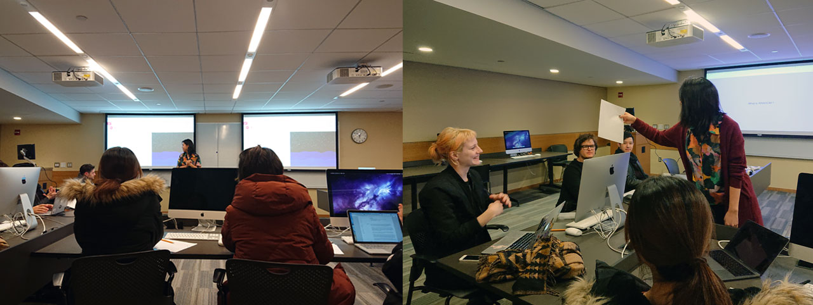
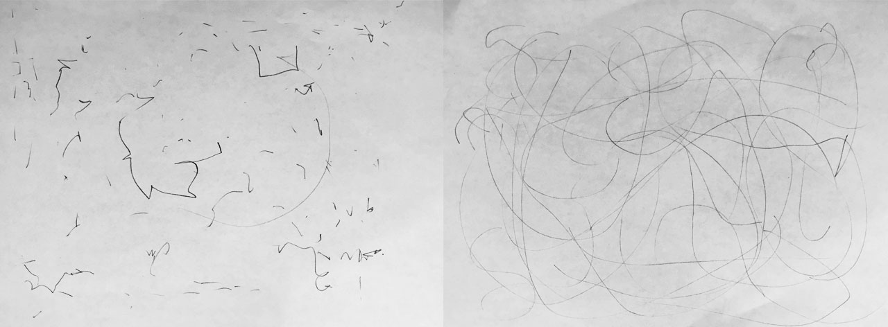

# Generative Random Art

In this workshop, we ask the fundamental question of what randomness is and what it looks like. By asking students to express what they think random is, and by looking at what can constitute as randomness in nature, the workshop attempts at defining random. We ask the question of whether complete randomness is useful in creating visuals and explore ways to tame the randomness to create a desired controlled randomized visuals in [p5.js](https://p5js.org/), a javascript library for creating visuals.

Students will approach the concept of random first with pen and paper, to reflect on what their idea of random is. Then they will examine whether their idea of random is truly random and compare it with p5's idea of randomness. We will also compare two functions that can be used to generate random values in p5.js: random() and noise(). We will attempt at gaining a deeper knowledge of these functions by applying different visuals using these functions and go further into controlling it with other functions such as modulus(%) and map().

This workshop is presented as a final project for [Teaching as Art](https://teachingasart.github.io/posts/teachingasartday/)class at NYU ITP.

## Structure of the Workshop
### What is Random?

### What is Noise?

