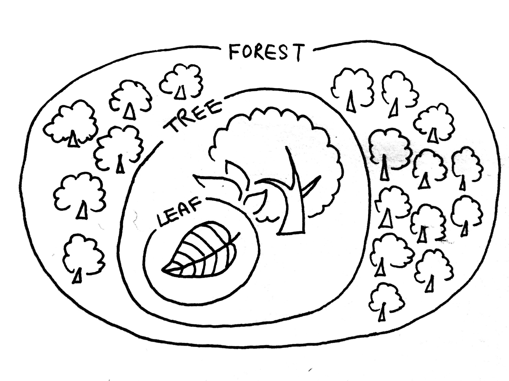

# Context

Below curriculum is designed for sophomore year high school students.

# Structure

Students have the liberty to choose 6 subjects among the provided selection of subject at the school. Please refer to the [List of Subjects](#list-of-subjects) section in this document below for the complete list of subjects that you can choose from. By allowing students to make their own selection of subjects to take, students will learn how to make their own choices and take charge of their own educational path.

Students are also asked to pick one subject within their selection as their primary subject of interest. Students with same subject of interest meet together on a weekly basis with the subject's adivising teacher to discuss more in-depth and real life and outside of textbook materials of the subject. Students are also asked to devise and execute a semester long personal research about a topic of their choice in the field of study, with the help of their advising teacher, for the fall semester. The deliverables differ depending on the subject.

In the spring semester, students are asked to collaborate with a student with a different primary subject. This collaboration will happen under a closer guidance of a advising teacher who will attend to the needs of the students and their project with specific needs of the proposed project. 

At the end of each semester, students have an opportunity to present on their semester-long personal researches / collaborative projects.

In addition to student's selection of subjects, all students are required to take one session of Physical Education and Assembly. They are also required to choose an extracurricular activity of their choice, which is scheduled for a duration of two sessions per week. Lastly, at the beginning and end of each day, students will attend homeroom with their homeroom teachers.

Students are expected to have sessions where they are not required to go into a class. At these times, they are expected to use the time at their own disgression to do assignments for their classes or to continue their personal researches. Any of the common spaces such as student lounges, library, cafeteria or outdoor campus grounds are always open for students to use at any given time during school hours.

# Motives

In order to study a tree, it is important to study the individual elements that comprises the tree, but it is equally important to study the forest, the environment in which the tree thrives in.

Kojin Karatani, in Chapter 4: Natural City of Architecture as Metaphor, Language, Number and Money (1965) talks about the semi-lattice structure of natural cities and the fact that this structure is one of the fundamental reasons that artificial cities with tree-like heirarchical structures are unable to thrive. Like natural cities, education and willingness to learn is a naturual human instinct that thrives at its best when done naturally, with individual's self-driven motivations.

This curriculum is designed to create a structure and learning environment in which students are encouraged to be self-driven in their education endeavors to achieve the maximum possible learning. This is facilitated by allowing students to decide what they are interested in and further their studies in a primary subject - looking at the leaf of a tree. They are also asked to collaborate with students interested in another subject different from their primary subject, in order to encourage the students to have an overview of the outside world and the other subjects that exist in academia - looking at the forest.

## List of Subjects:
* Mathematics
* Further Mathematics
* English Literature
* French
* Spanish
* Biology
* Chemistry
* Physics
* History
* Geography
* Sociology
* Economics
* Business Studies
* Accounting
* Psychology
* Religious Studies
* Philosophy
* Media Studies
* Design & Technology
* Art History
* Music

In the case of a student with subject choices of Mathematics, English Literature, Chemistry, Economics, Media Studies and Art History with Media Studies as primary subject, their schedule may look as below:

Sessions | Monday | Tuesday | Wednesday | Thursday | Friday
-------- | ------ | ------- | --------- | -------- | ------
Session 0 | Homeroom | Homeroom | Homeroom | Homeroom | Homeroom
Session 1 | Maths |  | English Literature | Economics  |  Assembly
Session 2 |  | Art History | Chemistry |  | Media Studies
Session 3 | Economics | Economics | Art History | Art History | Maths
Session 4 | English Literature |  | Media Studies | English Literature | Chemistry
Session 5 | Primary Subject Intensive | Media Studies | Primary Subject Intensive | Maths | Extracurricular
Session 6 | Primary Subject Intensive | Chemistry | Primary Subject Intensive | Physical Education | Extracurricular
Session 7 | Homeroom | Homeroom | Homeroom | Homeroom | Homeroom

# Learning Objectives

During this academic year, students will:
* learn to collaborate with fellow students and develop 
* learn to express their own ideas and opinions through making their own choices pertaining to their educational interests.
* learn to 

# Learning Outcome
Through the pursuit of the curriculum, students will 
